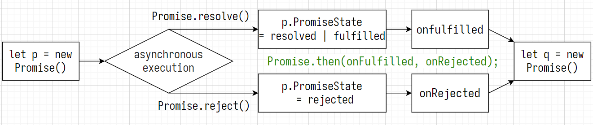

# Promise

`promise.PromiseState`

- pending
- resolved | fulfilled : pending => resolved | fulfilled
- rejected : pending => rejected

`promise.PromiseResult`: the result of the asynchronous task



### Start

```js
const p = new Promise((resolve, reject) => { // resolve, reject: predefined functions
    // ***** synchronous execution *****
    const xhr = new XMLHttpRequest();
    xhr.open('get', 'http://localhost:8000/main');
    xhr.send();
    xhr.onreadystatechange = function () {
        if (xhr.readyState === 4) {
            if (xhr.status >= 200 && xhr.status < 300) {
                resolve(xhr.response);
            } else {
                reject(xhr.status);
            }
        }
    }
});

// ***** ONLY onRejected *****
p.catch((reason /* reason = xhr.status */) => { // onRejected
    document.querySelector("#div1").innerHTML = "catch" + reason; // catch0
})

// ***** BOTH onFulfilled AND onRejected *****
const q = p.then((value /* value = xhr.response */) => { // onResolved | onFulfilled
    document.querySelector("#div1").innerHTML = value.toString();
}, (reason /* reason = xhr.status */) => { // onRejected
    document.querySelector("#div1").innerHTML = reason;
});
```

[promise.0](../../assets/promise.0.png)  
[promise.1](../../assets/promise.1.png)  
[promise.2](../../assets/promise.2.png)  
[promise.3](../../assets/promise.3.png)  
[promise.4](../../assets/promise.4.png)

### Promise Error Handling

```js
let p = new Promise((resolve, reject) => {
    setTimeout(() => { reject("err1"); }, 1000);
});

p.then((reason) => {
    throw new Error("err2");
}).then((reason) => { /* do nothing */ }).catch((reason) => {
    console.warn(reason); // err1
});
```

### Break the Promise Chain
```js
let p = new Promise((resolve, reject) => {
    setTimeout(() => { resolve("ok"); }, 1000);
});

p.then((reason) => {
    console.log(1); // 1
    return new Promise((resolve, reject) => { }); // break the promise chain
}).then((reason) => { console.log(2); }).catch((reason) => { console.log(3); }); // breaked
```
